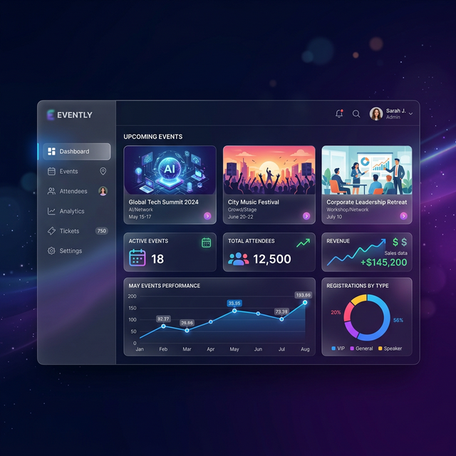

# 🌟 EventManager: Enterprise Event Orchestration



## 📌 Overview
**EventManager** is a premium, full-stack event orchestration platform designed to bridge the gap between organizers and attendees. Built with a focus on seamless user experience, high-performance real-time updates, and robust security, it empowers users to host global events, manage sophisticated task workflows, and handle ticket bookings with instant QR-code verification.

---

## 🚀 Key Features

### 🎫 Elite Event & Ticket Management
- **One-Click Orchestration**: Create, edit, and publish stunning events with high-resolution cover images and smart categorization.
- **Intelligent Booking Engine**: Real-time availability tracking with automated "Sold Out" state management and instant booking confirmations.
- **Encrypted QR Tickets**: Every booking generates a unique, secure QR code for instant check-in verification.
- **Organizer Insights**: Dedicated control center to monitor attendee lists, verify tickets, and manage event lifecycles.

### 📊 Professional Analytics Dashboard
- **Data Visualization**: Interactive 2D/3D activity charts powered by **Recharts** to track task progress and event engagement metrics.
- **Operational Quick-Actions**: Rapid navigation interface for mission-critical functions (Tasks, Events, Profile).
- **Live Performance Counters**: Real-time stats for pending actions, organized events, and ticket sales.

### 📝 Agile Task Management
- **Hyper-Threaded CRUD**: Sophisticated workflow management featuring categories, priority matrices, and dynamic due dates.
- **Predictive Filtering**: Advanced search and filter layers based on status, priority, and custom tags.
- **Supabase Realtime Sync**: Low-latency database synchronization ensuring your dashboard is always up-to-the-second.

### 🎨 Premium UI/UX Experience
- **Modern Glassmorphism**: A sleek, translucent design language built on **Tailwind CSS 4**.
- **Micro-Animations**: Fluid interactions and transitions powered by **Framer Motion**.
- **Accessibility First**: Responsive design that adapts perfectly to desktop, tablet, and mobile displays.

---

## 🛠️ Technology Stack

| Layer | Technology |
| :--- | :--- |
| **Frontend Runtime** | [React 19](https://react.dev/) |
| **Styling Engine** | [Tailwind CSS 4.0](https://tailwindcss.com/) |
| **Database & Auth** | [Supabase](https://supabase.com/) (PostgreSQL, RLS) |
| **Motion & FX** | [Framer Motion](https://www.framer.com/motion/) |
| **Data Viz** | [Recharts](https://recharts.org/) |
| **Notifications** | [React Hot Toast](https://react-hot-toast.com/) |
| **Routing** | [React Router 7](https://reactrouter.com/) |

---

## 📂 Project Architecture

```text
src/
├── components/     # High-fidelity reusable UI components
├── context/        # Multi-layered state management (Auth, Tasks, Events, Alerts)
├── pages/          # Core views (Dashboard, Events, Profile, Tasks)
├── routes/         # Centralized routing configuration with route guards
├── services/       # Supabase client and API integrations
├── utils/          # Standardized helper functions
└── assets/         # Global styles and static media
```

---

## ⚙️ Setup & Installation

### 1. Clone & Initialize
```bash
git clone https://github.com/zaakir10/Event-management.git
cd Event-management
npm install
```

### 2. Environment Configuration
Create a `.env` file in the root directory:
```env
VITE_SUPABASE_URL=your_supabase_project_url
VITE_SUPABASE_ANON_KEY=your_supabase_anon_key
```

### 3. Supabase Infrastructure Setup
- **Storage**: Create a public bucket named `avatars` and another for `event-images`.
- **Database**: Ensure Row Level Security (RLS) policies are active for `profiles`, `tasks`, `events`, and `tickets` tables.

### 4. Local Development
```bash
npm run dev
```

---

## 🛡️ License & Contributions
Distributed under the **MIT License**. We welcome contributions from the community! Feel free to fork the repository and submit pull requests for any features or bug fixes.

---

*Engineered with precision by [Zaakir](https://github.com/zaakir10)*

